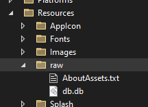

# Collection

## Необходимые библиотеки

- Microsoft.EntityFrameworkCore.Design
- Microsoft.EntityFrameworkCore.Proxies
- Microsoft.EntityFrameworkCore.Sqlite
- Microsoft.EntityFrameworkCore.Tools

## Создание модели

```
public class User
{
    [Key]
    public int Id { get; set; }
    public string Name { get; set; }
    public string Login { get; set; }
    public string Password { get; set; }
    public virtual Role Role { get; set; } 
    public virtual User Lider { get; set; } // virtual - обязателен при связи
}
```

## Создание класс DBContext

```
public class DBContext : DbContext
{
    // public virtual DbSet<Модель> { get; set; } 
    // virtual - обязательно!
    public virtual DbSet<Item> Items { get; set; }
    public virtual DbSet<ItemImage> ItemImages { get; set; }
    public virtual DbSet<Role> Roles { get; set; }
    public virtual DbSet<User> Users { get; set; }
    public virtual DbSet<UserItem> UserItems { get; set; }
    protected override void OnConfiguring(DbContextOptionsBuilder optionsBuilder)
    {
        string dbPath = Path.Combine(FileSystem.AppDataDirectory, "db.db");

        if (!File.Exists(dbPath))
        {
            using var ms = FileSystem.OpenAppPackageFileAsync("db.db").Result;
            using var fileStream = File.Create(dbPath);
            ms.CopyTo(fileStream);
        }

        optionsBuilder.UseLazyLoadingProxies();
        optionsBuilder.UseSqlite(dbPath);
    }
}
```

## App.xaml.cs

```
public partial class App : Application
{
    public App()
    {
        InitializeComponent();

        MainPage = new AppShell();
    }

    public static void InitilizationDB()
    {
        using var db = new DBContext();
        db.Database.EnsureCreated();
        db.Database.Migrate();
    }
    public static DBContext DB = new DBContext();
}
```

## MauiProgram.cs

```
    public static class MauiProgram
    {
        public static MauiApp CreateMauiApp()
        {
            var builder = MauiApp.CreateBuilder();
            builder
                .UseMauiApp<App>()
                .ConfigureFonts(fonts =>
                {
                    fonts.AddFont("OpenSans-Regular.ttf", "OpenSansRegular");
                    fonts.AddFont("OpenSans-Semibold.ttf", "OpenSansSemibold");
                });

#if DEBUG
    		builder.Logging.AddDebug();
#endif

            App.InitilizationDB();

            return builder.Build();
        }
    }
```

## Команды

```
dotnet ef migrations add InitialCreate
```

```
dotnet ef database update
```

## ВАЖНО

первоначально бд надо создать без
```
if (!File.Exists(dbPath))
{
    using var ms = FileSystem.OpenAppPackageFileAsync("db.db").Result;
    using var fileStream = File.Create(dbPath);
    ms.CopyTo(fileStream);
}
```

## Расположение db

