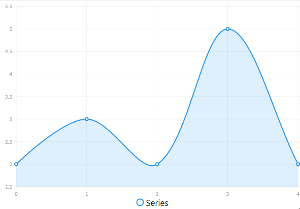
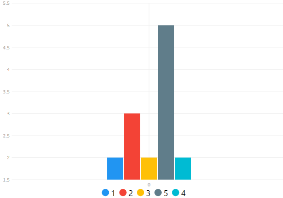
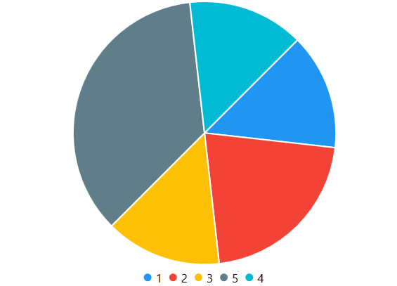

# Графики
## Основной код
### Линейная диаграмма

</img>

#### xaml
```
<charts:CartesianChart x:Name="CartesianCartes"></charts:CartesianChart>
```

#### cs
```
ChartValues<double> doubles = new ChartValues<double>();
foreach (var user in users)
    doubles.Add(items.Where(x => x.User.Id == user.Id).Count());

var series = new SeriesCollection()
{
    new LineSeries
    {
        Values = doubles,
        Fill = null
    }
};

CartesianCartes.Series = series;
```

### Столбчатая диаграмма

</img>

#### xaml
```
<charts:CartesianChart x:Name="TabCartes" Zoom="Xy"></charts:CartesianChart>
```

#### cs
```
series = new SeriesCollection();

foreach (var user in users)
{
    series.Add(new ColumnSeries
    {
        Title = user.Name.ToString(),
        Values = new ChartValues<double>() { items.Where(x => x.User.Id == user.Id).Count() }
    });
}

TabCartes.Series = series;
```

### Круглая диаграмма

</img>

#### xaml
```
<charts:PieChart x:Name="PieCartes"></charts:PieChart>
```

#### cs
```
series = new SeriesCollection();

foreach (var user in users)
{
    series.Add(new PieSeries
    {
        Title = user.Name.ToString(),
        Values = new ChartValues<double> { items.Where(x => x.User.Id == user.Id).Count() },
        Fill = null,
    });
}

PieCartes.Series = series;
```