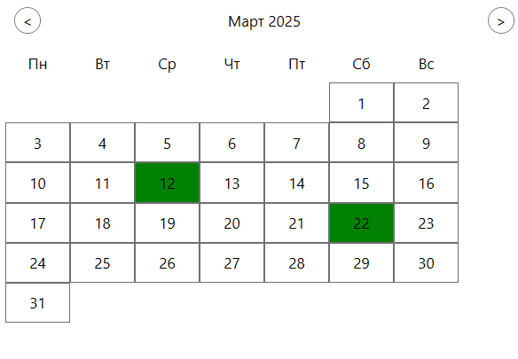
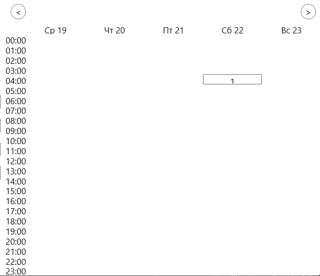
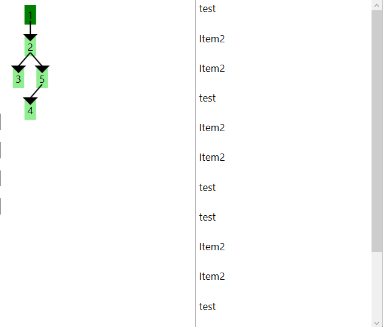
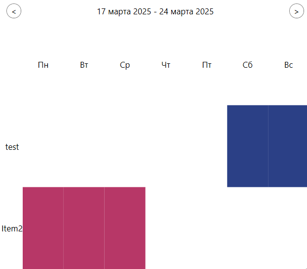

# Генерация объектов

В программе вы можете увидеть реализацию 
- Календаря
- Расписания
- Дерева подразделений
- Диаграммы ганта

</img>
</img>
</img>
</img>

## База кода

### Добавление в объект

Grid
```
GridPanel.Children.Add(<объект>);
```

StackPanel
```
StackPanelPanel.Children.Add(<объект>);
```

Border
```
BorderPanel.Child = <объект>;
```

### Очистка

```
GridPanel.Children.Clear();
```

### Расмещение по Grid

```
Grid.SetRow(<объект>, <индекс строки>);
Grid.SetColumn(<объект>, <индекс колонки>);
```

## Основная суть алгоритов

### Перебор

1. Создаем начальную и конечную точку

```
var dateStart = dateNow;
var dateEnd = dateNow.AddDays(7);
```

2. Пробегаемся от начальной до конечной

```
while (dateStart < dateEnd)
{
    // Основной код размещения
};
```

### Длина смещения недели

```
var dat = (int)dateStart.DayOfWeek - 1;
if (dat == -1)
    dat = 6;
```

Используется для регулирования Понедельника - Воскресения, например при генерации календаря или расписания

Расписание
```
Grid.SetColumn(<объект>, (dat + index_week) % 7 + 1);
```

Календарь
```
var dateN = dateStart.Day + dat - 1;
GridPanel.Children.Add(<объект>);
Grid.SetColumn(<объект>, dateN % 7);
Grid.SetRow(<объект>, dateN / 7 + 1);
```

### Рекурсия

Рекурсия чаще всего используется при дереве отрезков. В промышленном программирование - это дерево подразделений и другие аналоги

Пример реализации
```
private void GenerationItems(User user)
{
    var items = App.DB.UserItems.Where(x => x.User.Id == user.Id).ToList().Select(x => x.Item).ToList(); // Добавление items в общий котел
    Items.AddRange(items);
        
    var users = App.DB.Users.ToList().Where(x => x.LiderId == user.Id).ToList(); // Получение нижних пользователей
    foreach (var userDown in users) // Спуск на уровень ниже
        GenerationItems(userDown);     
}
```

## Canvas

Работает аналогично, как в Wpf, но есть свои приколы

### Получение координат

```
var point1 = textBlock1.TranslatePoint(new Point(textBlock1.ActualWidth / 2, textBlock1.ActualHeight / 2 - 10), MainCanvas);
var point2 = textBlock2.TranslatePoint(new Point(textBlock2.ActualWidth / 2, textBlock2.ActualHeight / 2 + 10), MainCanvas);
```

### Отрисовка

```
CompositionTarget.Rendering += (s, e) =>
{
    // Отрисовка координат
};
```